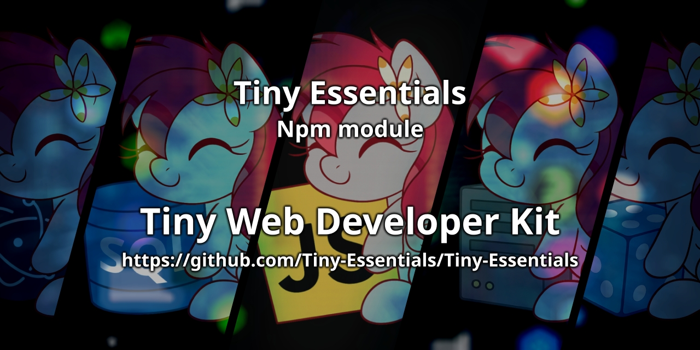

<div align="center">

<p>
    <a href="https://discord.gg/TgHdvJd"></a>
    <a href="https://www.npmjs.com/package/tiny-essentials"></a>
    <a href="https://www.npmjs.com/package/tiny-essentials"></a>
</p>
<p>
    <a href="https://www.patreon.com/JasminDreasond"></a>
    <a href="https://ko-fi.com/jasmindreasond"></a>
    <a href="https://chain.so/address/BTC/bc1qnk7upe44xrsll2tjhy5msg32zpnqxvyysyje2g"></a>
    <a href="https://chain.so/address/LTC/ltc1qchk520v4u8334n5dntmgeja55gc5g5rrkgpd4f"></a>
</p>
<p>
    <a href="https://nodei.co/npm/tiny-essentials/"></a>
</p>
</div>

# 🧩 Tiny Essentials

**Tiny Essentials** is a collection of small, essential scripts designed to be used across various projects. These simple utilities are crafted for speed, ease of use, and versatility.  

## ✨ Features  

Tiny Essentials provides a wide range of utilities — from array manipulations and time calculations to object helpers and custom tools.  
For the **full list of features and usage examples**, please check the [documentation](./docs).  

## 📦 Installation

You can install Tiny Essentials via npm:

```bash
npm install tiny-essentials
```

Or download the scripts directly from this repository.

## 🧪 Module Versions

The core version of Tiny Essentials (version 1) is located in the folder [`/src/v1`](./src/v1).  

A detailed README is available inside the [`v1`](./src/v1) folder, which contains a full description of all utility modules and their functionalities.  
We recommend checking it out if you want to see all available tools in this version and how to use them individually or collectively via the `index.mjs` global module.

## 📚 Documentation

Looking for detailed module explanations and usage examples?  
Check out the full documentation here:

👉 [Go to docs page](./docs/v1/README.md)

---

## 📦 More Tiny Essentials Modules

- 🤖 [**tiny-ai-api**](https://github.com/Tiny-Essentials/Tiny-AI-API) — Minimal AI API wrapper.
- 🎲 [**tiny-dices**](https://github.com/Tiny-Essentials/Tiny-Dices) — Simple dice and randomness utilities.
- 🔐 [**tiny-crypto-suite**](https://github.com/Tiny-Essentials/Tiny-Crypto-Suite) — Lightweight cryptography toolkit.
- 🖥️ [**tiny-server-essentials**](https://github.com/Tiny-Essentials/Tiny-Server-Essentials) — Node.js server utilities.
- 🪟 [**tiny-electron-essentials**](https://github.com/Tiny-Essentials/Tiny-Electron-Essentials) — Essential tools for Electron apps.
- 🗃️ [**puddysql**](https://github.com/Tiny-Essentials/PuddySQL) — Smart SQL engine for structured data, tags, and advanced queries.
- 📢 [**my-tiny-events**](https://github.com/Tiny-Essentials/My-Tiny-Events) — A event emitter system for JavaScript, inspired by Node.js EventEmitter with support for multi-event handling and listener management.

---

### 🔧 Recommended Tool: **JsStore**

Although not part of Tiny Essentials, we recommend using [**JsStore**](https://www.npmjs.com/package/jsstore) if you're looking for a well-maintained and developer-friendly solution to interact with **IndexedDB** using SQL-like syntax.

> 💬 *This is a personal recommendation. This project is not sponsored or affiliated with JsStore.*

---

## 🗃️ Legacy Code

The scripts previously maintained in this repository have been migrated to the following location:

👉 https://github.com/Tiny-Essentials/Tiny-Essentials-Legacy

This includes modules such as:

- `@tinypudding/firebase-lib`
- `@tinypudding/discord-oauth2`
- `@tinypudding/mysql-connector`
- `@tinypudding/puddy-lib`

These modules are preserved for backwards compatibility and may not receive further active development.

---

## 🤝 Contributions

Feel free to fork, contribute, and create pull requests for improvements! Whether it's a bug fix or an additional feature, contributions are always welcome.

## 📝 License

This project is licensed under the LGPL-3.0 License - see the [LICENSE](LICENSE) file for details.

### 💡 Credits

This project was inspired by the need for lightweight, reusable code that can be used across many different kinds of applications. Contributions and suggestions are always appreciated!

> 🧠 **Note**: This documentation was written by [ChatGPT](https://openai.com/chatgpt) and [Gemini](https://gemini.google.com), AI assistants developed by OpenAI and Google, based on the project structure and descriptions provided by the repository author.  
> If you find any inaccuracies or need improvements, feel free to contribute or open an issue!

---

<div align="center">
<a href="./test/img/"></a>
<br/>
Made with tiny love!
</div>