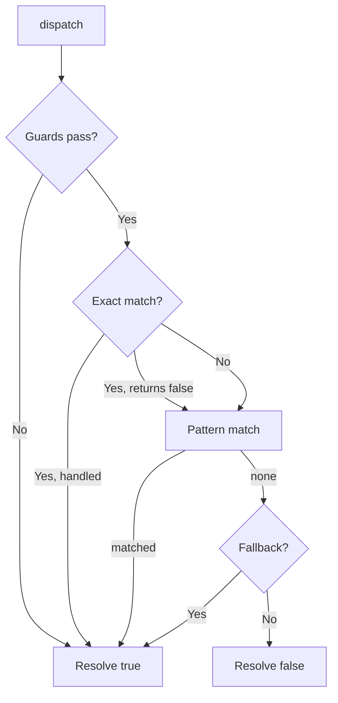

# 📬 TinyPushRouter

> A tiny, transport-agnostic router that sends normalized push messages to the right handler — nothing more, nothing less.

`TinyPushRouter` is a small routing engine for service worker `push` events. It does **not** touch the Notification API. It only decides **which handler runs** for a given message. That separation keeps your code testable in plain Node.js, with zero browser mocks.

---

## 📑 Table of Contents

- [✨ Why TinyPushRouter?](#-why-tinypushrouter)
- [📦 Installation](#-installation)
- [🚀 Quick Start](#-quick-start)
- [🧠 Core Concepts](#-core-concepts)
- [📖 API Reference](#-api-reference)
- [🍳 Day-to-Day Recipes](#-day-to-day-recipes)
- [✅ Best Practices](#-best-practices)
- [⚠️ Gotchas](#️-gotchas)

---

## ✨ Why TinyPushRouter?

Push handling usually turns into a giant `if / else if` chain inside `self.addEventListener('push', ...)`. That is hard to test and harder to read.

TinyPushRouter gives you:

| Feature | Benefit |
| --- | --- |
| 🎯 Exact, pattern, and fallback routes | Match `message.type` however you need |
| 🛡️ Guards | Drop messages before any handler runs |
| 🧩 Transport agnostic | No `Notification` API inside the router |
| 🧪 Node-testable | Pure functions in, pure functions out |
| 🔗 Chainable API | Fluent registration |

---

## 🚀 Quick Start

```js
import TinyPushRouter from 'tiny-essentials/libs/sw/service/TinyPushRouter';

const router = new TinyPushRouter();

// 1. Exact match on message.type
router.on('chat:message', async (message, context) => {
  await context.engine.showNotification(message.title, { body: message.body });
  context.notificationShown = true;
});

// 2. Pattern match
router.onMatch(/^order:/, async (message) => {
  console.log('Order event received:', message.type);
});

// 3. Fallback
router.otherwise((message) => {
  console.log('Unhandled message type:', message.type);
});

// 4. Dispatch
self.addEventListener('push', (event) => {
  event.waitUntil(
    (async () => {
      const message = event.data.json();
      const context = { event, message, engine: null, handled: false, notificationShown: false };
      await router.dispatch(message, context);
    })(),
  );
});
```

---

## 🧠 Core Concepts

### 📨 The Message

Every route receives a **normalized message**. The only property the router itself reads is `message.type` (a `string`). Everything else is passed through untouched.

### 🧩 The Context

The `context` object is shared between the router and the active handler during a single dispatch cycle.

| Property | Type | Description |
| --- | --- | --- |
| `event` | `PushEvent` | The native push event. |
| `message` | `TinyPushMessage` | The normalized message. |
| `engine` | `TinyServiceWorkerEngine` | The engine that received the push. |
| `handled` | `boolean` | Set to `true` to stop the chain. |
| `notificationShown` | `boolean` | Set to `true` when a notification was displayed. |

### 🛡️ Guards

A guard runs **before** any handler. Return `false` to drop the message completely.

```js
router.use((message) => {
  return message.type !== 'internal:ping'; // drop pings
});
```

### 🔗 The Fall-Through Rule

A handler that returns `false` tells the router: *"I did not handle this, keep going."* Any other return value (including `undefined`) stops the chain.

---

## 📖 API Reference

### `use(guard)`

Registers a guard. Every guard runs before the handler.

- **Parameter:** `guard: TinyPushGuard`
- **Returns:** `this` (chainable)
- **Throws:** `TypeError` if `guard` is not a function.

> 🚫 A guard that returns `false` drops the message: no handler runs, and the `push` promise resolves with `true`, so the browser does **not** show a generic *"This site has been updated in the background"* notification.

---

### `on(type, handler)`

Registers a handler for an **exact** `message.type`.

- **Parameters:**
  - `type: string` — The type to match.
  - `handler: TinyPushHandler` — The handler.
- **Returns:** `this` (chainable)
- **Throws:** `TypeError` if `type` is not a non-empty string or `handler` is not a function.

```js
router.on('user:follow', (message) => {
  console.log('New follower!');
});
```

---

### `onMatch(pattern, handler)`

Registers a handler for every `message.type` that matches a **regular expression**.

- **Parameters:**
  - `pattern: RegExp` — The pattern applied to `message.type`.
  - `handler: TinyPushHandler` — The handler.
- **Returns:** `this` (chainable)
- **Throws:** `TypeError` if `pattern` is not a `RegExp` or `handler` is not a function.

```js
router.onMatch(/^order:\w+$/, (message) => {
  console.log('Order event:', message.type);
});
```

---

### `otherwise(handler)`

Registers the handler used when **no other handler matches**.

- **Parameter:** `handler: TinyPushHandler`
- **Returns:** `this` (chainable)
- **Throws:** `TypeError` if `handler` is not a function.

```js
router.otherwise((message) => {
  console.warn('No route for:', message.type);
});
```

---

### `catch(handler)`

Registers an error handler. When set, any error thrown inside a guard or handler is caught and forwarded here instead of rejecting the `dispatch` promise.

- **Parameter:** `handler: (error: unknown, message: unknown) => void`
- **Returns:** `this` (chainable)
- **Throws:** `TypeError` if `handler` is not a function.

```js
router.catch((error, message) => {
  console.error('Dispatch failed for', message, error);
});
```

---

### `has(type)`

Reports whether a handler is registered for the given type (exact or pattern).

- **Parameter:** `type: string`
- **Returns:** `boolean`

```js
router.has('user:follow'); // true
```

---

### `get size`

- **Returns:** `number` — The number of registered handlers (exact + pattern).

```js
console.log(router.size); // 3
```

---

### `dispatch(message, context)`

Dispatches a message to the first matching handler.

**Order of execution:**

1. Run every guard. If one returns `false`, stop and resolve `true`.
2. Run the exact-match handler (if any). If it returns `false`, continue.
3. Run the first matching pattern handler. If it returns `false`, continue.
4. Run the fallback (if any).
5. Resolve `false` if nothing claimed the message.

- **Parameters:**
  - `message: TinyPushMessage` — The normalized message.
  - `context: TinyPushContext` — The dispatch context.
- **Returns:** `Promise<boolean>` — `true` when a handler claimed the message.
- **Throws:** `TypeError` if `message` or `context` are invalid.



---

### `static get PUSH_TYPE()`

Exposes the `PUSH_TYPE` constant, so consumers do not need a second import.

```js
console.log(TinyPushRouter.PUSH_TYPE);
```

---

## 🍳 Day-to-Day Recipes

### 🗂️ Route by feature namespace

```js
router
  .on('chat:message', handleChat)
  .on('chat:typing', handleTyping)
  .onMatch(/^order:/, handleOrder);
```

### 🧪 Test a handler in isolation

```js
import { test } from 'node:test';
import assert from 'node:assert/strict';
import TinyPushRouter from 'tiny-essentials/libs/sw/service/TinyPushRouter';

test('drops ping messages', async () => {
  const router = new TinyPushRouter();
  let called = false;

  router.use((message) => message.type !== 'internal:ping');
  router.otherwise(() => {
    called = true;
  });

  await router.dispatch({ type: 'internal:ping' }, {});
  assert.equal(called, false);
});
```

### 🚨 Centralize error reporting

```js
router.catch((error, message) => {
  reportToSentry(error, { type: message?.type });
});
```

---

## ✅ Best Practices

- 🎯 Use `on()` for known types and `onMatch()` for families of types.
- 🛡️ Prefer guards over duplicating `if` checks inside every handler.
- 🔗 Chain your registrations — every method returns `this`.
- 🧪 Keep handlers free of `Notification` calls; put them behind the engine in `context`.

---

## ⚠️ Gotchas

- 🔁 **Stateful regex:** avoid the global (`g`) flag in `onMatch` patterns. `RegExp.prototype.test` is stateful with `g` and will skip matches between calls.
- 🧊 **`has()` does not check the fallback.** It only reports exact and pattern routes.
- 🧱 **`size` counts routes, not the fallback.** A router with only `otherwise()` reports `size === 0`.
- 🛑 **A thrown error with no `catch()` handler rejects the `dispatch` promise.** Always register a `catch()` in production.
